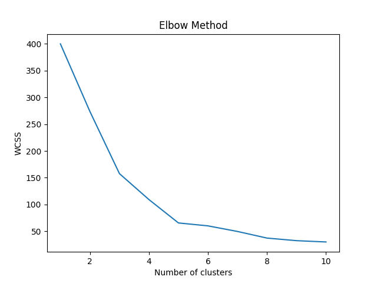
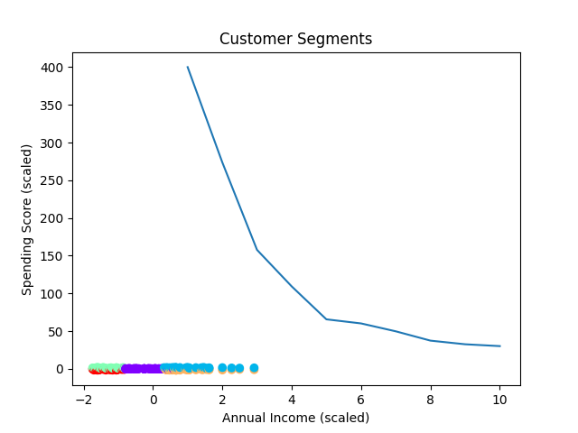

# 🧠 Customer Segmentation with K-Means Clustering

This project uses K-Means Clustering to segment customers based on their **Annual Income** and **Spending Score**, helping businesses understand different customer types for targeted marketing.

---

## 📁 Project Structure

customer-segmentation/
│
├── Mall_Customers.csv # Original dataset
├── kmeans_customer_segmentation.py # Python script
├── elbow_method.png # Elbow method to find optimal clusters
├── customer_segments.png # Cluster visualization
├── clustered_customers.csv # Dataset with cluster labels
└── README.md # Project documentation


---

## 📊 Overview

The dataset contains the following fields:
- **CustomerID**
- **Gender**
- **Age**
- **Annual Income (k$)**
- **Spending Score (1–100)**

We use only **Annual Income** and **Spending Score** for clustering.

---

## 🧪 Methodology

1. **Data Preprocessing**  
   - Load and inspect the dataset using `pandas`
   - Select relevant features (`Annual Income`, `Spending Score`)
   - Normalize using `StandardScaler`

2. **Clustering (K-Means)**
   - Try cluster counts from 1 to 10
   - Plot **Elbow Method** to determine optimal `k`
   - Apply K-Means with chosen `k` (in this case, 5)

3. **Results**
   - Plot the final clusters
   - Save clustered data to a new CSV file

---

## 📷 Visual Results

### 📌 Elbow Method Plot
This helps determine the best number of clusters (elbow point at 5):



### 🧑‍🤝‍🧑 Final Customer Segments
Each color represents a different segment:



---

## 💾 Output File

After clustering, each customer is assigned a cluster (0–4). You can find this in:

**`clustered_customers.csv`**

---

## ⚙️ Requirements

Install required libraries using pip:

```bash
pip install pandas matplotlib scikit-learn
```
---

## 🚀 How to Run

Make sure all files are in the same directory, then run:
```bash
python kmeans_customer_segmentation.py
```
The script will:
Print the first few rows of the dataset
Generate and save two plots:

elbow_method.png
customer_segments.png

Export a new dataset with cluster labels to:

clustered_customers.csv
